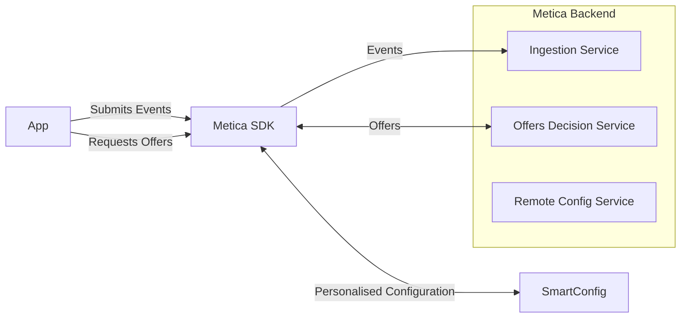

# MeticaAPI Unity SDK Guide

**Disclaimer: please note that the SDK is undergoing some quick changes so, for the time being, this information might contain inaccuracies.**

---

This document provides a quick summary on how to use the MeticaAPI Unity SDK.

Further information about the Metica backend API can be found at
the [documentation](https://docs.metica.com/integration) page.

## Overview

The Metica Unity SDK provides a simple interface to interact with the backend Metica API. The SDK provides simplified methods to
fetch offers and configs (abbraviation for SmartConfigs) and to log user actions with your app/game as events. The Metica Unity SDK
takes care of networking nuance, caching and much more so you don't have to.



### Terminology

_Application_

Your application or game that uses the Metica services.

_User_

A user or player of the application. Player and user are used interchangeably.

_Event_

An 'event' refers to a user's action within the context of the application. For example, clicking a button, logging in, clicking an ad, etc.
The properties (or attributes) associated with these events vary based on the type of the event;
e.g., the property `totalAmount` must be set when logging an in-app offer `purchase` event. 

_User Properties_

Sometimes (and formerly) called _User Attributes_, user properties consist of general information about the user that
best characterises them in your application. For example you could define your user properties to include game progression,
demographics, user preferences, player's level, etc.

## What you need

To use the Metica Unity SDK you need:
- An API key, obtainable in the Metica platform (www.metica.com)
- An appId, configurable in the Metica platform.

## Installation

In Unity, open the Package Manager (Window > Package Manager) and click on
the '+' button in the top left corner. Select "Add package from git URL..." and enter the following:

```https://github.com/meticalabs/metica-unity-sdk.git?path=SDK```

## Upgrading from 1.3.1 to 1.5.0

The MeticaAPI class was the main *surface* to use the SDK. We preserved it but since we renamed some types, you may need to add, at the start of the file, one or both of the following lines where `OffersByPlacement` and/or `MeticaLogger` are not found.

```
using MeticaLogger = Log;
using OffersByPlacement = Metica.SDK.OfferResult;
```

## New way to use the SDK (async/await)

**Additionally** to the previous static call style via `MeticaAPI`, you can retrieve an instance of `IMeticaSdk` with

```
private IMeticaSdk _sdk = MeticaSdk.SDK;
```

If you do so, you can now take advantage of the asynchronous calls. Example:

```
configResult = await _sdk.GetConfigsAsync(new List<string> { "dynamic_difficulty" });
```

One of the main advantages is that you now have a return type rather than having to pass a callback method.

### Event Dispatch (Flush)

When you log an event (both with static calling or using async), it isn't guaranteed to be sent immediately as events are sent in bulks.

If you need to make sure events are immediately sent to the ingestion endpoint, you can use the `MeticaAPI.RequestDispatchEvents` call but don't overuse it as the default behaviour helps aggregating events for lower network load.

## Setup

No code is needed to initialize the Metica Unity SDK as, with recent changes, the process has been reduced to the following steps in Unity.

1. In the Hierarchy view, right click (on an empty area) and select `Metica > Add SDK`. This will add a prefab
with the MeticaUnitySdk component attached. Alternatively you can manually drag and drop the prefab from `Packages/Metica Unity Sdk/Runtime/Unity/Prefabs/`.
2. Select the prefab and click the `Create Configuration` button to create and save it in the folder you select.\*
3. Select the configuration file and fill the fields (see [SDK Configuration](#sdk-configuration))
4. If needed, add the file to the MeticaSdk prefab. When you use the *Create Configuration* button the configuration should be automatically linked.

\*: Alternatively, create a configuration asset by right clicking a folder in the Project View and selecting `Create > Metica > SDK > New SDK Configuration`. This can also be found in the main menu under `Assets > Create` but it will create the asset in the Assets' root.

## Available SDK Operations

### Initialize the API

If you upgraded to the new SDK and your code is still calling the `Initialise` method to prepare the MeticaAPI, it's not a problem but you can remove it. If you leave it, a harmless warning will appear.

With versions of the SDK <= 1.3.1 the initialization is done as follows:

⚠️: This method is obsolete. Please prefer the next call using `SdkConfig`.
```csharp
MeticaAPI.Initialise("userId", "appId", "apiKey", result => { 
    if (result.Result) { Debug.Log("Metica API Initialized"); } 
    else { Debug.Log("Failed to Initialize Metica API: " + result.Error); } 
});
```

You can also pass an instance of `SdkConfig`, if you want to have greater control over the SDK's operations.
```csharp
var config = SdkConfig.Default();
config.logLevel = LogLevel.Off;
config.networkTimeout = 5;
MeticaAPI.Initialise("userId", "appId", "apiKey", config, result => { 
    ... 
});
```

## SDK Configuration

The SdkConfig provides the following configuration parameters:

| Property                   | Description
|----------------------------|---------------------------------------------------------------------------------------------------------------------------------------------------------------------------------------------------
| `apiKey`					 | Your API key
| `appId`					 | The application identifier accessible from Metica's dashboard.
| `initialUserId`			 | A string that identifies a user. This can change during the lifetime of your app/game so, for example and depending on your needs, this could be a temporary id like "guest" that later becomes a specific userId, or it can be the current user's id if it's already identified.
| `Base Endpoint`           | Base metica endpoint : https://api-gateway.prod-eu.metica.com
| `Events Log Dispatch Cadence`     | The cadence, in seconds, that triggers an events dispatch.
| `displayLogFlushCadence`   | The number of stored events above which they are dispecthed (actually sent to Metica). Events in fact don't get always sent immediately, they accumulate and get sent in bulks.
| `Events Log Dispatch Cadence`    | The cadence, in seconds, by which the logged events will be sent to the ingestion service.
| `Events Log Dispatch Max Queue Size`   | The maximum number of pending logged events before they are sent to the ingestion service. When this value is reached, oldest accumulated events will be dropped to accommodate most recent ones.
| `Http Cache TTL Seconds`    | The time-to-live, in seconds, for the http-level cache.
| `Http Request Timeout`           | The network timeout, in seconds, for the calls to any Metica endpoint.
| `Log Level`                 | The level of the SDK's logs. The valid values are provided by the enumeration `Metica.Unity.LogLevel`                                                                                             

### Get Offers

Asynchronously fetches offers for specified (or all) placements from the Metica API.
The result is delivered through a callback and is a dictionary of placements and their respective offers.

A dictionary of user attributes can be passed to the method to personalize the offers. If not, then the last known user
attributes are used.

Also, a `DeviceInfo` object can be passed to the method to provide device information. If not, then the device
information is automatically collected.

```csharp
MeticaAPI.GetOffers(new string[] { "placementId1", "placementId2" }, result => { 
        if (result.Error == null) { 
            foreach (var offer in result.Result.placements["placementId1"]) 
            { 
                Debug.Log(offer); 
            } 
        } else 
        { 
            Debug.Log("Failed to get offers: " + result.Error); 
        } 
    },
    userProperties: {
        { "someAttribute", true },
        { "another", "someValue" }
    }, 
    deviceInfo: new DeviceInfo()
        {
            appVersion = "1.0.0",
            timezone = "UTC",
            locale = "en_US",
            store = "AppStore"
        });
```

The `DeviceInfo` stores information regarding the client context, and it can differ across different devices of the same
user.

An overview of the role of each DeviceInfo property:

| Property   | Description                                                                                                                                                                                     | Example         |
|------------|-------------------------------------------------------------------------------------------------------------------------------------------------------------------------------------------------|-----------------|
| store      | Identifies the app store related to the in-game offers. Possible values: <br/>- `GooglePlayStore`, the Google store <br/> - `AppStore`, the Apple store                                         | GooglePlayStore |
| timezone   | Device timezone expressed with [IANA tz identifier format](https://en.wikipedia.org/wiki/List_of_tz_database_time_zones)                                                                        | +01:00          | 
| appVersion | The game/app version, in [SemVer](https://semver.org/) format                                                                                                                                   | 1.2.3           | 
| locale     | Locale expressed as a combination of language (ISO 639) and country (ISO 3166), // [JDK 8 standard reference](https://www.oracle.com/java/technologies/javase/jdk8-jre8-suported-locales.html). | en-US           |

### Remote Configuration

The `GetConfig` method can be used to retrieve the Smart Configs.

Similar to the `GetOffers` method, the operation is performed asynchronously and the result is delivered through a callback.
Because the result is specific to each application, the SDK represents it in a generic manner, through a `Dictionary<string, object>` instance.
Each entry in the dictionary represents a configuration key and its value. The latter is expected to be valid json.

Also, again similar to the `GetOffers` method, the operation can be passed a dictionary of user properties and the device details, as a `DeviceInfo` instance, in order to personalise the returned configuration. The personalisation happens on the server side, based on the configured variations and experimentation setup.

Example usage:

```csharp
MeticaAPI.GetConfig(
    configKeys: new string[] { "key1", "key2" },
    responseCallback: result => { 
        if (result.Error == null) 
        {             
            Debug.Log(result.Result["key1"]);             
        } else 
        { 
            Debug.Log("Failed to get offers: " + result.Error); 
        } 
    },
    userProperties: {
        { "someAttribute", true },
        { "another", "someValue" }
    }, 
    deviceInfo: new DeviceInfo()
        {
            appVersion = "1.0.0",
            timezone = "UTC",
            locale = "en_US",
            store = "AppStore"
        });
```

If the `configKeys` argument is `null` or empty, then all the configured keys will be returned.

Note that the server side response for this call is going to be cached according to the cache control directives returned by the server.

For more details regarding the `DeviceInfo` properties, check the section on [Get Offers](#2-get-offers)

### Offer Lifecycle Events

Logs offer related events like offer display, offer purchase, and offer interaction.

Examples:
```csharp
MeticaAPI.LogOfferDisplay("<offerId>", "<placementId>");
MeticaAPI.LogOfferDisplayWithProductId("<productId>");
MeticaAPI.LogOfferPurchase("<offerId>", "<placementId>", 10.0, "USD");
MeticaAPI.LogOfferPurchaseWithProductId("<productId>", 10.0, "USD");
MeticaAPI.LogOfferInteraction("<offerId>", "<placementId>", "click");
MeticaAPI.LogOfferInteractionWithProductId("<productId>", "click");
```

### Full State Update

Formerly known as `LogUserAttributes`.

`LogFullStateUpdate` sends a complete snapshot of the user's state to the server, replacing any previously stored data. 
This method fully resets the user's state on the server and expects all relevant state information to be included in the request.
Any user attributes that are currently stored in the server with the given userId but are not sent with this update, will be erased.Logs updates to user attributes and custom user events.

```csharp
Dictionary<string, object> userAttributes = new Dictionary<string, object> { { "level", 25 }, { "favoriteItem", "shield" } };
MeticaAPI.LogFullStateUpdate(userAttributes); 
```

### Partial State Update

`LogPartialStateUpdate` sends a partial update of the user's state to the server
modifying or adding only the provided fields while preserving those that are currently stored on the server.
This method cannot erase existing fields (like `LogFullStateUpdate` does); it can only overwrite values or introduce new ones.

### Custom Payloads

All events, except `fullStateUpdate`, `partialStateUpdate` and `CustomEvent`, support a custom payload that can include any information.  
It's passed as a `Dictionary<string, object>` to the logging methods. To avoid confusion with other fields, it is recommended to pass the parameter by name, i.g. `LogInstall(customPayload: playerExtraParams)` rather than just `LogInstall(playerExtraParams)`.

**Example**  

```
Dictionary<string, object> myCustomPayload {
{ "set", "Intense Stare Magic Mastery" },
{ "cosmetic", "flamingo shades" },
};
LogOfferInteraction(someOfferId, somePlacementId, "selected", myCustomPayload);
LogOfferPurchase(someOfferId, somePlacementId, 2.49, "GBP", customPayload: myCustomPayload);
```

### Custom Event Logging

Formerly known as `LogUserEvent`.

`LogCustomEvent` logs custom application events. The only required field in the Dictionary is `eventType` which is used by Metica to
distinguish the different types of events.

```csharp
Dictionary<string, object> customUserEvent = new Dictionary<string, object> { { "eventType", "completed_level" }, { "eventDetails", "level 5" } };
MeticaAPI.LogCustomEvent(userEvent);
```

**Note:** The final event that is submitted to the Metica backend is enriched with additional information, so an
additional Dictionary instance is allocated internally and the application event attributes are copied into that.
It's possible to avoid the extra allocation by passing `true` to the `reuseDictionary` argument.

```csharp
// this will avoid the extra allocation but will mutate the passed userEvent
MeticaAPI.LogUserEvent(userEvent, true);
```

### Code Sample

An example usage of the above operations can be found in a small code sample can be found
at `TestProject/Assets/SampleScript.cs`.

## Privacy Manifest

For iOS, iPadOS, tvOS and watchOS apps, we provide
a [privacy manifest](https://developer.apple.com/documentation/bundleresources/privacy_manifest_files)
at [Assets/Plugins/PrivacyInfo.xcprivacy](Assets/Plugins/PrivacyInfo.xcprivacy)
that describes the data collected by the Metica SDK. 
