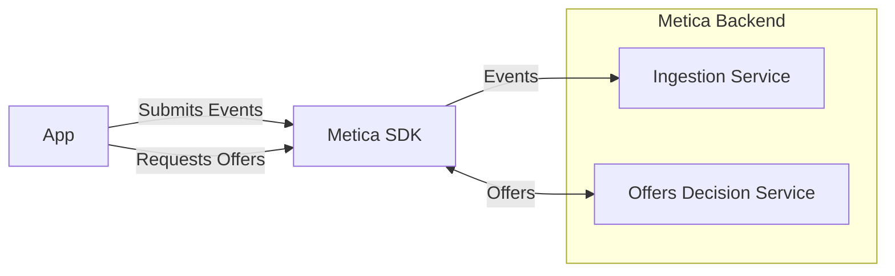

# MeticaAPI Unity SDK Guide

This document provides a quick summary on how to use the MeticaAPI Unity SDK.

## Overview

The MeticaAPI Unity SDK provides a simple interface to interact with the backend Metica API. The SDK provides methods to fetch offers, and log user interactions with the system as events.




### Terminology
_Event_

An 'event' refers to a user's action or interaction with the system. For example, clicking a button, entering text, etc. The properties or attributes associated with these events could be numerous e.g., `event.totalAmount` could represent the total amount spent by a user purchasing an in-app offer.
This is more dynamic information about the user, and is used to derive information amount the user and predict their future actions.

_User Attributes_

The attributes that describe a user of the app. These could be game progression, demographic information, user preferences, etc. 
This is more static information about the user, and is used to personalize the offers and make them more relevant to the user.

## Installation
The installation can be done simply through the Package Manager in Unity. Select Window > Package Manager and click on the '+' button in the top left corner. Select "Add package from git URL" and enter the following URL:

```https://github.com/meticalabs/metica-unity-sdk.git?path=/MeticaUnitySDK```

## Available SDK Operations


### 1. Initialize the API

Use the `Initialise` method to prepare the MeticaAPI for use.

- **Short Description**: Prepares the Metica API for operation, initializing internal components.
- **Example Code**: 
```csharp
MeticaAPI.Initialise("userId", "appId", "apiKey", result => { 
    if (result.IsSuccess) { Debug.Log("Metica API Initialized"); } 
    else { Debug.Log("Failed to Initialize Metica API: " + result.Error); } 
});
```

### 2. Get Offers

After initialization, use the `GetOffers` method to obtain offers available for particular placements.

- **Short Description**: Asynchronously fetches offers for specified placements from the Metica API.
- **Example Code**: 

```csharp
MeticaAPI.GetOffers(new string[] { "placementId1", "placementId2" }, result => { 
    if (result.IsSuccess) { 
        foreach (var offer in result.Payload.Data) 
        { 
            Debug.Log(offer); 
        } 
    } else 
    { 
        Debug.Log("Failed to get offers: " + result.Error); 
    } 
});
```

### 3. Log Offer Display, Purchase, and Interaction

You can log user interaction with the system using methods `LogOfferDisplay`, `LogOfferPurchase`, and `LogOfferInteraction`.

- **Short Description**: Logs user interactions like offer display, offer purchase, and offer interaction.
- **Example Code**: 

```csharp
MeticaAPI.LogOfferDisplay("offerId", "placementId"); 
MeticaAPI.LogOfferPurchase("offerId", "placementId", 10.0, "USD"); 
MeticaAPI.LogOfferInteraction("offerId", "placementId", "interactionType");
```

### 4. User Attributes Logging and Custom Event Logging

Use `LogUserAttributes` and `LogUserEvent` methods to log user attributes and custom events respectively.

- **Short Description**: Logs updates to user attributes and custom user events.
- **Example Code**: 

```csharp
Dictionary<string, object> userAttributes = new Dictionary<string, object> { { "age", 25 }, { "gender", "male" } };
Dictionary<string, object> customUserEvent = new Dictionary<string, object> { { "eventType", "completed level" }, { "eventDetails", "level 5" } };
MeticaAPI.LogUserAttributes(userAttributes); 
MeticaAPI.LogUserEvent(userEvent);
```

## Editor Components
