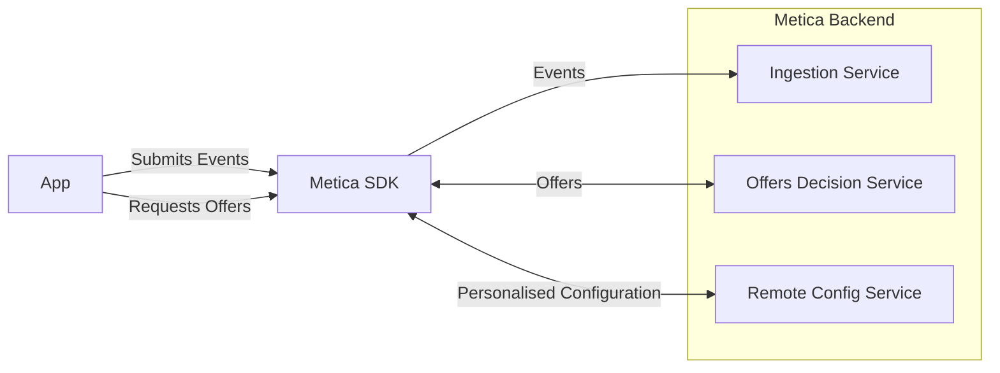

# MeticaAPI Unity SDK Guide

This document provides a quick summary on how to use the MeticaAPI Unity SDK.

Further information about the Metica backend API can be found at
the [documentation](https://docs.metica.com/api-metica-integration#api-request-1) page.

## Overview

The MeticaAPI Unity SDK provides a simple interface to interact with the backend Metica API. The SDK provides methods to
fetch offers, and log user interactions with the system as events.



### Terminology

_Event_

An 'event' refers to a user's action or interaction with the system. For example, clicking a button, entering text, etc.
The properties or attributes associated with these events could be numerous e.g., `event.totalAmount` could represent
the total amount spent by a user purchasing an in-app offer.
This is more dynamic information about the user, and is used to derive information amount the user and predict their
future actions.

_User Attributes_

The attributes that describe a user of the app. These could be game progression, demographic information, user
preferences, etc.
This is more static information about the user, and is used to personalize the offers and make them more relevant to the
user.

## Installation

The installation can be done simply through the Package Manager in Unity. Select Window > Package Manager and click on
the '+' button in the top left corner. Select "Add package from git URL" and enter the following URL:

```https://github.com/meticalabs/metica-unity-sdk.git?path=SDK```

## Available SDK Operations

### 1. Initialize the API

Use the `Initialise` method to prepare the MeticaAPI for use. To obtain your API key please contact Metica.

```csharp
MeticaAPI.Initialise("userId", "appId", "apiKey", result => { 
    if (result.Result) { Debug.Log("Metica API Initialized"); } 
    else { Debug.Log("Failed to Initialize Metica API: " + result.Error); } 
});
```

You can optionally pass an instance of SdkConfig as well, if you want to have greater control over the SDK's operations.

```csharp
var config = SdkConfig.Default();
config.logLevel = LogLevel.Off;
config.networkTimeout = 5;
MeticaAPI.Initialise("userId", "appId", "apiKey", config, result => { 
    ... 
});
```

The SdkConfig provides the following configuration parameters

| Property                   | Description                                                                                                                                                                                       |
|----------------------------|---------------------------------------------------------------------------------------------------------------------------------------------------------------------------------------------------|
| `offersEndpoint`           | The full endpoint to the Metica offers endpoint.                                                                                                                                                  |
| `ingestionEndpoint`        | The full endpoint to the Metica ingestion service.                                                                                                                                                |
| `remoteConfigEndpoint`     | The full endpoint to the Metica remote config service.                                                                                                                                            |
| `maxDisplayLogEntries`     | The maximum number of entries stored in the displays log. This limit is shared by all offers and once reached, oldest entries will be removed and replaced by newly incoming ones.                |
| `displayLogFlushCadence`   | The cadence, in seconds, by which the displays log will be persisted to the filesystem.                                                                                                           |
| `displayLogPath`           | The filesystem path where the display log will be persisted.                                                                                                                                      |
| `eventsLogFlushCadence`    | The cadence, in seconds, by which the logged events will be sent to the ingestion service.                                                                                                        |
| `maxPendingLoggedEvents`   | The maximum number of pending logged events before they are sent to the ingestion service. When this value is reached, oldest accumulated events will be dropped to accommodate most recent ones. |
| `offersCacheTtlMinutes`    | The time-to-live, in minutes, for the offers cache.                                                                                                                                               |
| `offersCachePath`          | The filesystem path where the offers cache will be stored.                                                                                                                                        |
| `remoteConfigCachePath`    | The filesystem path where the remote config cache will be stored.                                                                                                                                 |
| `networkTimeout`           | The network timeout, in seconds, for the calls to any Metica endpoint.                                                                                                                            |
| `logLevel`                 | The level of the SDK's logs. The valid values are provided by the enumeration `Metica.Unity.LogLevel`                                                                                             |
| `eventsSubmissionDelegate` | A delegate that is invoked whenever the asynchronous events submission process is completed.                                                                                                      |

The `eventsSubmissionDelegate` delegate's type is 
```c#
delegate void EventsSubmissionResultDelegate(ISdkResult<Int32> result);
```

If the events' submission was successful, then the reported `Int32` result is the number of events submitted.
Otherwise, in case of error, the field `result.Error` will be non-empty and provide some description of the error.

### 2. Get Offers

After initialization, use the `GetOffers` method to obtain offers available for particular placements.

Asynchronously fetches offers for specified placements from the Metica API.
The result is delivered through a callback and is a dictionary of placements and their respective offers.

A dictionary of user attributes can be passed to the method to personalize the offers. If not, then the last known user
attributes are used.

Also, a `DeviceInfo` object can be passed to the method to provide device information. If not, then the device
information is automatically collected.

```csharp
MeticaAPI.GetOffers(new string[] { "placementId1", "placementId2" }, result => { 
        if (result.Error == null) { 
            foreach (var offer in result.Result.placements["placementId1"]) 
            { 
                Debug.Log(offer); 
            } 
        } else 
        { 
            Debug.Log("Failed to get offers: " + result.Error); 
        } 
    },
    userProperties: {
        { "someAttribute", true },
        { "another", "someValue" }
    }, 
    deviceInfo: new DeviceInfo()
        {
            appVersion = "1.0.0",
            timezone = "UTC",
            locale = "en_US",
            store = "AppStore"
        });
```

The `DeviceInfo` stores information regarding the client context, and it can differ across different devices of the same
user.

An overview of the role of each DeviceInfo property:

| Property   | Description                                                                                                                                                                                     | Example         |
|------------|-------------------------------------------------------------------------------------------------------------------------------------------------------------------------------------------------|-----------------|
| store      | Identifies the app store related to the in-game offers. Possible values: <br/>- `GooglePlayStore`, the Google store <br/> - `AppStore`, the Apple store                                         | GooglePlayStore |
| timezone   | Device timezone expressed with [IANA tz identifier format](https://en.wikipedia.org/wiki/List_of_tz_database_time_zones)                                                                        | +01:00          | 
| appVersion | The game/app version, in [SemVer](https://semver.org/) format                                                                                                                                   | 1.2.3           | 
| locale     | Locale expressed as a combination of language (ISO 639) and country (ISO 3166), // [JDK 8 standard reference](https://www.oracle.com/java/technologies/javase/jdk8-jre8-suported-locales.html). | en-US           |

### 3. Remote Configuration

The `GetConfig` method can be used to obtain the remote configuration. The configuration is returnekey

Similar to the `GetOffers` method, the operation is performed asynchronously and the result is delivered through a callback.
Because the result is specific to each application, the SDK represents it in a generic manner, through a `Dictionary<string, object>` instance.
Each entry in the dictionary represents a configuration key and its value. The latter is expected to be valid json.

Also, again similar to the `GetOffers` method, the operation can be passed a dictionary of user properties and the device details, as a `DeviceInfo` instance, in order to personalise the returned configuration. The personalisation happens on the server side, based on the configured variations and experimentation setup.

Example usage:

```csharp
MeticaAPI.GetConfig(
    configKeys: new string[] { "key1", "key2" },
    responseCallback: result => { 
        if (result.Error == null) 
        {             
            Debug.Log(result.Result["key1"]);             
        } else 
        { 
            Debug.Log("Failed to get offers: " + result.Error); 
        } 
    },
    userProperties: {
        { "someAttribute", true },
        { "another", "someValue" }
    }, 
    deviceInfo: new DeviceInfo()
        {
            appVersion = "1.0.0",
            timezone = "UTC",
            locale = "en_US",
            store = "AppStore"
        });
```

If the `configKeys` argument is `null` or empty, then all the configured keys will be returned.

Note that the server side response for this call is going to be cached according to the cache control directives returned by the server.

For more details regarding the DeviceInfo properties, check the section on [Get Offers](#2-get-offers)

### 4. Offer Lifecycle Events

Logs offer related events like offer display, offer purchase, and offer interaction.

```csharp
MeticaAPI.LogOfferDisplay("offerId", "placementId"); 
MeticaAPI.LogOfferPurchase("offerId", "placementId", 10.0, "USD"); 
MeticaAPI.LogOfferInteraction("offerId", "placementId", "interactionType");
```

### 5. User Attributes Logging

Logs updates to user attributes and custom user events.

```csharp
Dictionary<string, object> userAttributes = new Dictionary<string, object> { { "level", 25 }, { "favoriteItem", "shield" } };
MeticaAPI.LogUserAttributes(userAttributes); 
```

### 6. Custom Event Logging

Logs custom application events. The only required field in the Dictionary is `eventType` which is used by Metica to
distinguish the
different types of events.

```csharp
Dictionary<string, object> customUserEvent = new Dictionary<string, object> { { "eventType", "completed_level" }, { "eventDetails", "level 5" } };
MeticaAPI.LogUserEvent(userEvent);
```

**Note:** The final event that is submitted to the Metica backend is enriched with additional information, so an
additional Dictionary instance is allocated internally and the application event attributes are copied into that.
It's possible to avoid the extra allocation by passing `true` to the `reuseDictionary` argument.

```csharp
// this will avoid the extra allocation but will mutate the passed userEvent
MeticaAPI.LogUserEvent(userEvent, true);
```

### Code Sample

An example usage of the above operations can be found in a small code sample can be found
at [Samples/MeticaSample.cs](Samples/MeticaSample.cs).

## Privacy Manifest

For iOS, iPadOS, tvOS and watchOS apps, we provide
a [privacy manifest](https://developer.apple.com/documentation/bundleresources/privacy_manifest_files)
at [Assets/Plugins/PrivacyInfo.xcprivacy](Assets/Plugins/PrivacyInfo.xcprivacy)
that describes the data collected by the Metica SDK. 
