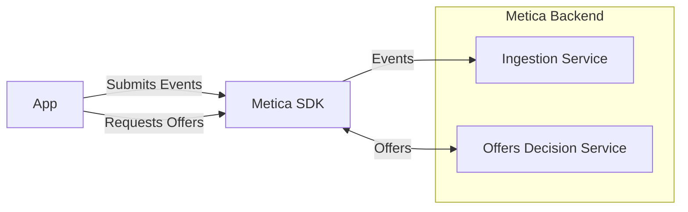
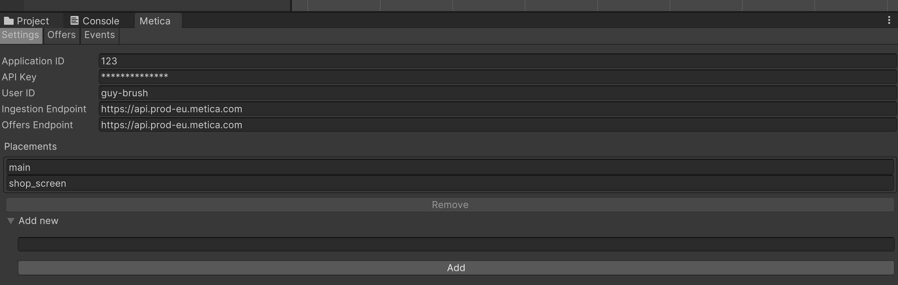
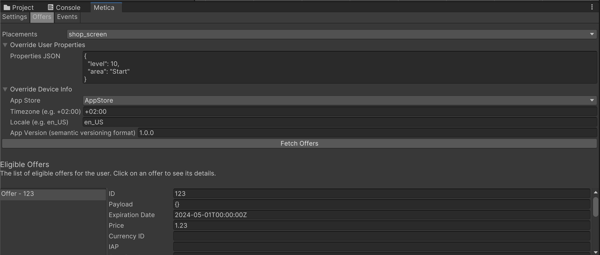
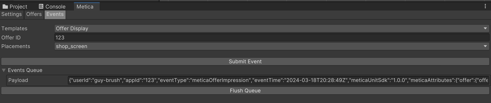

# MeticaAPI Unity SDK Guide

This document provides a quick summary on how to use the MeticaAPI Unity SDK.

## Overview

The MeticaAPI Unity SDK provides a simple interface to interact with the backend Metica API. The SDK provides methods to fetch offers, and log user interactions with the system as events.




### Terminology
_Event_

An 'event' refers to a user's action or interaction with the system. For example, clicking a button, entering text, etc. The properties or attributes associated with these events could be numerous e.g., `event.totalAmount` could represent the total amount spent by a user purchasing an in-app offer.
This is more dynamic information about the user, and is used to derive information amount the user and predict their future actions.

_User Attributes_

The attributes that describe a user of the app. These could be game progression, demographic information, user preferences, etc. 
This is more static information about the user, and is used to personalize the offers and make them more relevant to the user.

## Installation
The installation can be done simply through the Package Manager in Unity. Select Window > Package Manager and click on the '+' button in the top left corner. Select "Add package from git URL" and enter the following URL:

```https://github.com/meticalabs/metica-unity-sdk.git```

## Available SDK Operations


### 1. Initialize the API

Use the `Initialise` method to prepare the MeticaAPI for use. To obtain your API key please contact Metica. 

```csharp
MeticaAPI.Initialise("userId", "appId", "apiKey", result => { 
    if (result.Result) { Debug.Log("Metica API Initialized"); } 
    else { Debug.Log("Failed to Initialize Metica API: " + result.Error); } 
});
```

### 2. Get Offers

After initialization, use the `GetOffers` method to obtain offers available for particular placements.

Asynchronously fetches offers for specified placements from the Metica API. 
The result is delivered through a callback and is a dictionary of placements and their respective offers.

A dictionary of user attributes can be passed to the method to personalize the offers. If not, then the last known user attributes are used.

Also, a `DeviceInfo` object can be passed to the method to provide device information. If not, then the device information is automatically collected.

```csharp
MeticaAPI.GetOffers(new string[] { "placementId1", "placementId2" }, result => { 
    if (result.IsSuccess) { 
        foreach (var offer in result.placements["placementId1"]) 
        { 
            Debug.Log(offer); 
        } 
    } else 
    { 
        Debug.Log("Failed to get offers: " + result.Error); 
    } 
});
```

### 3. Offer Lifecycle Events

Logs offer related events like offer display, offer purchase, and offer interaction.

```csharp
MeticaAPI.LogOfferDisplay("offerId", "placementId"); 
MeticaAPI.LogOfferPurchase("offerId", "placementId", 10.0, "USD"); 
MeticaAPI.LogOfferInteraction("offerId", "placementId", "interactionType");
```

### 4. User Attributes Logging 

Logs updates to user attributes and custom user events.


```csharp
Dictionary<string, object> userAttributes = new Dictionary<string, object> { { "age", 25 }, { "gender", "male" } };
MeticaAPI.LogUserAttributes(userAttributes); 
```

### 5. Custom Event Logging

Logs custom application events. The only required field is `eventType` which is used by Metica to distinguish the different types of events.

```csharp
Dictionary<string, object> customUserEvent = new Dictionary<string, object> { { "eventType", "completed_level" }, { "eventDetails", "level 5" } };
MeticaAPI.LogUserEvent(userEvent);
```
### Code Sample
An example usage of the above operations can be found in a small code sample can be found at [Samples/MeticaSample.cs](Samples/MeticaSample.cs).

## Editor Components

Besides the programmatic integration, you can also test the Metica integration directly from the Unity Editor.

Select Window > Metica to open the Metica window. Here you can initialize the API, fetch offers, and log events.

### Settings Panel
In this panel you can setup the API and defined the available placements.


### Offers Panel
In this panel you can fetch offers for the defined placements.


### Events Panel
In this panel you can log events.



## Privacy Manifest
For iOS, iPadOS, tvOS and watchOS apps, we provide a [privacy manifest](https://developer.apple.com/documentation/bundleresources/privacy_manifest_files) at [Assets/Plugins/PrivacyInfo.xcprivacy](Assets/Plugins/PrivacyInfo.xcprivacy)
that describes the data collected by the Metica SDK. 
